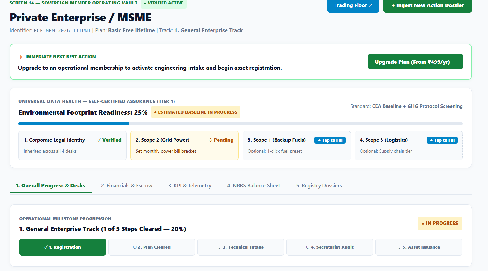
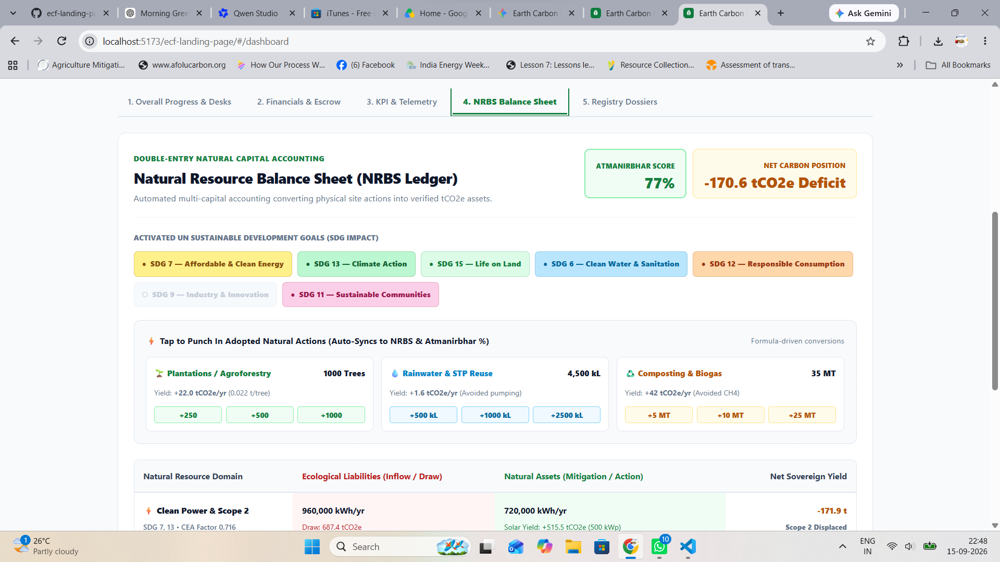
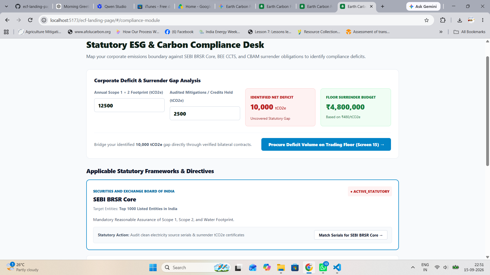
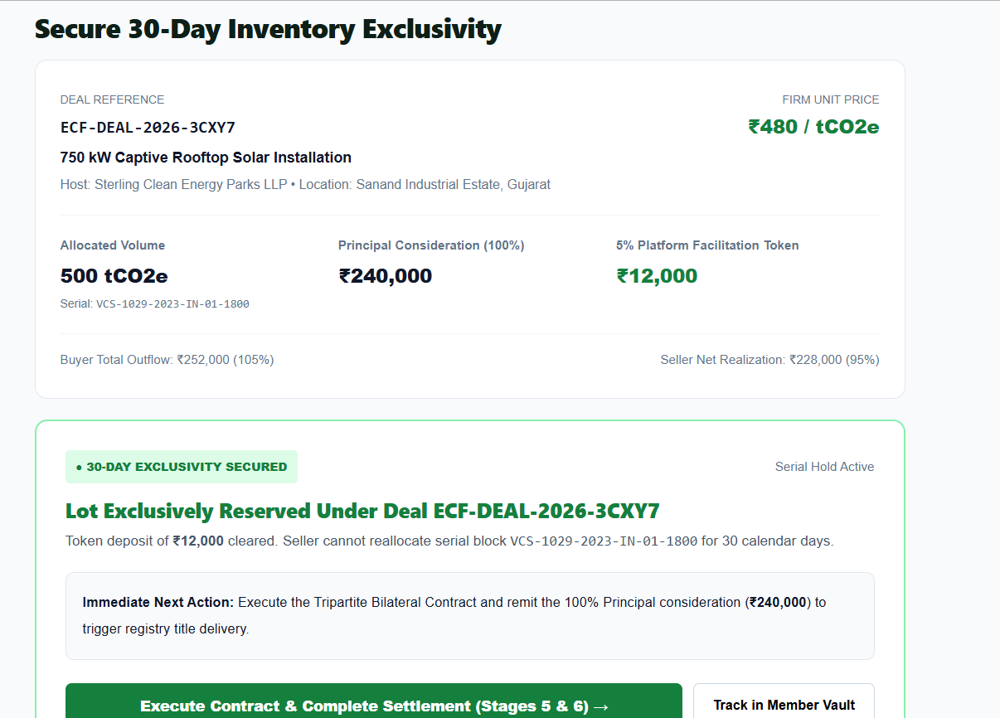

# Earth Carbon Foundation (ECF) — Sovereign Operating Vault

> **Institutional-grade Natural Capital Accounting & Bilateral Carbon Trading Clearinghouse**

---

### Core Pillars & Architecture

1. **Natural Resource Balance Sheet (NRBS):** Dual-column accounting derived from the Divyajyoti Trust standard, balancing physical withdrawals against clean assets (AMS-I.D, AMS-I.J, AMS-I.K) to calculate the **Atmanirbhar Index %**.
2. **Corporate Compliance Desk:** Real-time Scope 1, 2, and 3 deficit gap matching for SEBI BRSR Core, BEE CCTS, and EU CBAM mandates.
3. **Tripartite Escrow Floor:** Bilateral trading settlements featuring 5% advance reservations, 30-day serial locks, and verified registry title delivery.
4. **PoA Asset Aggregator:** Small-scale renewable asset intake with 4-Gate statutory affirmations replacing document uploads.

---

### Platform Previews

| Sovereign Member Vault | NRBS Natural Capital Ledger |
| :---: | :---: |
|  |  |

| Statutory Compliance Desk | Tripartite Escrow Desk |
| :---: | :---: |
|  |  |

---

### Operational Deliverables & Certifications

* **GHG Protocol Carbon Footprint Memo:** Scope 1, 2, and 3 baseline inventory with spot-market surrender budget analysis.
* **UN SDG Impact Citation:** Third-party verified accreditation seal for clean energy (SDG 7), clean water (SDG 6), climate action (SDG 13), and life on land (SDG 15).
* **Self-Certified Tier 1 Assurance:** Digital audit signatures with statutory radio gate affirmations substituting for physical paper trails.
